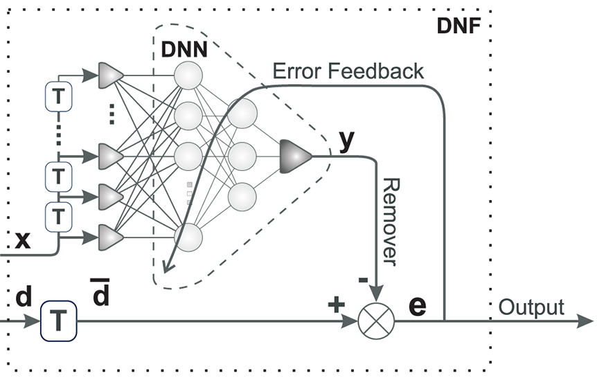

# Deep Neuronal Filter (DNF) -- executorch version



This is work in progress. It works but needs more TLC!

## Prerequisites Libraries and packages

executorch:

```
cmake --preset linux -DEXECUTORCH_BUILD_EXTENSION_TRAINING=ON -DCMAKE_BUILD_TYPE=Release -DCMAKE_INSTALL_PREFIX=/usr/local -DEXECUTORCH_ENABLE_LOGGING=ON -DEXECUTORCH_LOG_LEVEL=ERROR .
cd cmake-out
make
sudo make install
```

## How to compile

Type:

```
cmake .
```
to create the makefile and then

```
make
```
to compile the library and the demos.

## Example

[Simple instructional example which removes 50Hz from an ECG](ecg_filt_demo).

## Credits
 - Bernd Porr
